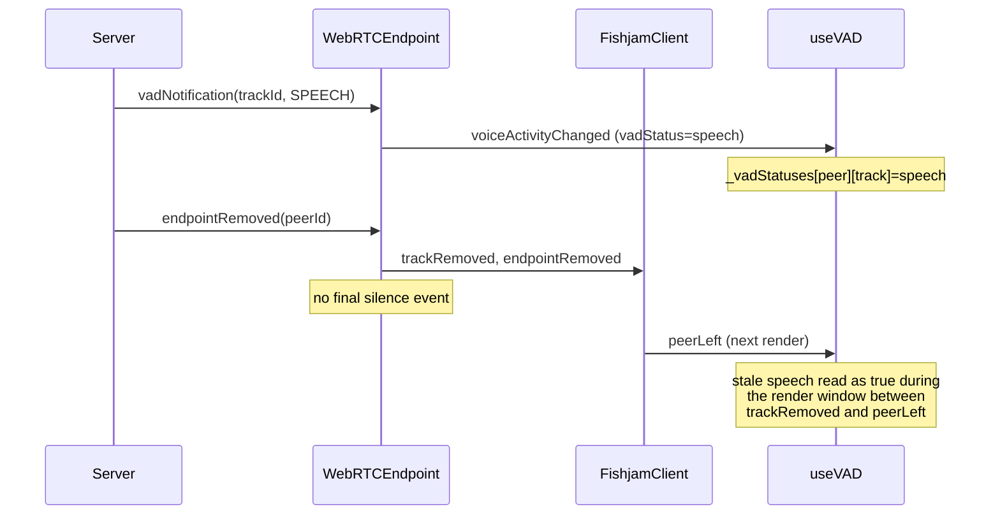

## Root causes

### Issue 1: Remote VAD stuck on `speech` after disconnect

When a speaking peer leaves, `Remote.removeRemoteTrack` drops the track without emitting a final `silence` event, and `useVAD` builds its result by iterating every key of an append-only `_vadStatuses` map, so the stale `speech` entry is visible until the tile unmounts (which happens a render after `trackRemoved`):

```73:84:packages/webrtc-client/src/tracks/Remote.ts
  private removeRemoteTrack = (trackId: TrackId) => {
    const remoteTrack = this.remoteTracks[trackId];
    if (!remoteTrack) throw new Error(`Track ${trackId} not found`);

    const remoteEndpoint = this.remoteEndpoints[remoteTrack.trackContext.endpoint.id];
    if (!remoteEndpoint) throw new Error(`Endpoint ${remoteTrack.trackContext.endpoint.id} not found`);

    remoteEndpoint.tracks.delete(trackId);
    delete this.remoteTracks[trackId];

    this.emit('trackRemoved', remoteTrack.trackContext);
  };
```

```91:103:packages/react-client/src/hooks/useVAD.ts
  const vadStatuses = useMemo(
    () =>
      ({
        ...Object.fromEntries(
          Object.entries(_vadStatuses).map(([peerId, tracks]) => [
            peerId,
            Object.values(tracks).some((vad) => vad === "speech"),
          ]),
        ),
        ...localVAD,
      }) satisfies Record<PeerId, boolean>,
    [_vadStatuses, localVAD],
  );
```

### Issue 2: Local VAD flickers during reconnect

`initConnection` calls `disconnect()` and builds a brand-new `WebRTCEndpoint`, so during reconnect the local peer id + microphone `trackId` transition through `A → undefined → '' → B`. Each deps change tears down the polling effect (forcing `isSpeaking(false)`) and restarts it. On top of that, speech transitions have no debounce (`SILENCE_DEBOUNCE_TICKS = 2` only smooths silence), so any brief audio spike flips to `true` instantly.

```37:64:packages/react-client/src/hooks/useLocalVAD.ts
  useEffect(() => {
    if (options.disabled || !localPeerId || !microphoneTrackId) return;
    ...
    return () => {
      clearTimeout(timeoutId);
      setIsSpeaking(false);
    };
  }, [options.disabled, fishjamClient, localPeerId, microphoneTrackId]);
```



## Fixes

### 1. `packages/webrtc-client/src/tracks/Remote.ts`

In `removeRemoteTrack`, if the track's current `vadStatus === 'speech'`, set it to `'silence'` and emit `voiceActivityChanged` BEFORE emitting `trackRemoved` (and before `FishjamClient` runs `ctx.removeAllListeners()`). This guarantees any listener on the track context gets a closing silence notification.

### 2. `packages/react-client/src/hooks/useVAD.ts`

Build the returned record from the current `micTracksWithSelectedPeerIds` (not by iterating `_vadStatuses`), reading each peer's status at the current microphone `trackId` only. This makes stale entries invisible and also future-proofs against mic-track replacement (old `trackId` stuck on `speech` while a new `trackId` starts fresh).

Optionally also prune `_vadStatuses` inside the subscription `useEffect` so the map doesn't grow unbounded over long sessions; can reuse `getDefaultVadStatuses` when `micTracksWithSelectedPeerIds` changes.

### 3. `packages/react-client/src/hooks/useLocalVAD.ts`

- Consume `isReconnecting` from `FishjamClientStateContext` and treat it as an additional "disabled" condition so polling is paused during reconnect.
- Keep the `setIsSpeaking(false)` cleanup (so the indicator correctly drops to not-speaking when entering reconnect / when the hook unmounts), but because we now gate on `isReconnecting`, the effect won't re-run multiple times for the transient `localPeerId`/`microphoneTrackId` churn that happens during a single reconnect cycle.
- Add a small speech-direction debounce (e.g. require 1 consecutive above-threshold tick before flipping to `true`, symmetric with `SILENCE_DEBOUNCE_TICKS`) to absorb single-tick audio-level spikes.

### 4. Tests

- Extend [packages/webrtc-client/tests/events/vadNotificationEvent.test.ts](packages/webrtc-client/tests/events/vadNotificationEvent.test.ts) with a case that asserts `voiceActivityChanged` is emitted with `silence` when a track in `speech` state is removed (via both `removeTracks` and `removeRemoteEndpoint`).
- Add a react-client hook test (or extend existing ones) verifying `useVAD` returns `false` for a peer whose microphone track was just removed, and does not leak stale entries when a peer leaves `peerIds`.
