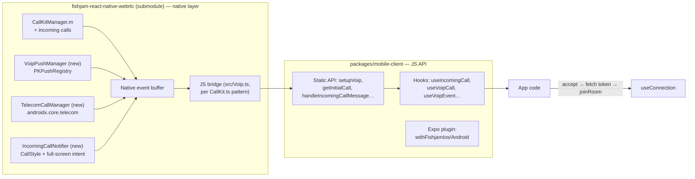
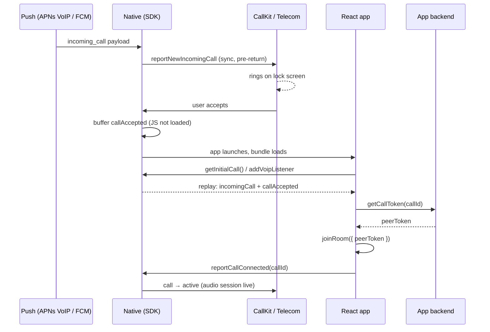

# RFC: VoIP Calls Helper (iOS CallKit + PushKit, Android Telecom)

| | |
|---|---|
| **Status** | Draft — for team discussion |
| **Author** | Miłosz Filimowski |
| **Date** | 2026-06-11 |
| **Scope** | Design only. Implementation will be planned separately after review. |

## Summary

Apps building VoIP calling on Fishjam today hand-write ~800 lines of native plumbing per integration: CallKit provider + PushKit delegate + audio-session juggling on iOS, a full custom incoming-call notification/activity stack on Android, and a JS state layer on top. This RFC proposes SDK-level VoIP helpers: incoming-call support and VoIP pushes on iOS (extending our existing CallKit integration), Android Telecom integration (which no reference integration has today), and a user-friendly hook surface in `@fishjam-cloud/react-native-client`.

Three decisions are already made and treated as constraints here:

1. **Code location**: native code extends the existing CallKit integration in the `fishjam-react-native-webrtc` submodule; JS API, hooks, and Expo plugin changes live in `packages/mobile-client`. No new package.
2. **Android push**: forwarding API — the app keeps its own FCM handler and forwards data to the SDK (`handleIncomingCallMessage`). No SDK-owned `FirebaseMessagingService` in v1.
3. **Room join on accept**: app-controlled — on accept, the app fetches a peer token from its backend (by `callId`) and calls `joinRoom`. No peer tokens in push payloads.

---

## 1. Problem statement

The reference integration is InstaWork's `integration/fishjam` branch of their `mobile` repo. To ship VoIP calls on Fishjam they had to write, per platform:

### iOS (`IWCallKitCore.swift`, `IWVoiceCall.swift`, AppDelegate wiring)

- **CXProvider configuration**: provider setup, `CXProviderConfiguration` (ringtone, icon, max calls, supported handle types), CXCallController transactions for answer/end/mute.
- **PushKit delegate in the AppDelegate**: `PKPushRegistry` setup at launch, token registration forwarding, and — critically — synchronous `reportNewIncomingCall` inside `didReceiveIncomingPush` to satisfy the iOS 13+ kill rule (§3.1).
- **Manual `RTCAudioSession` handling**: `useManualAudio` mode, deferring audio unit start until CallKit's `didActivateAudioSession`, restoring on deactivate. Getting this timing wrong produces one-way/no audio — the single most common CallKit integration bug.
- **Event buffering for JS-not-ready**: accepts on the lock screen arrive before the React bundle has loaded; native code must queue events and replay them when JS subscribes.
- **Missed-call timeout**: a native 40-second timer that ends the ringing call and reports it as unanswered.
- **Ringback timing** for outgoing calls.

### Android (`IWIncomingCallNotifier.kt`, `IWIncomingCallActivity.kt`, FCM service)

- A **full-screen incoming-call activity** with lock-screen flags (`showWhenLocked`, `turnScreenOn`), an accept/decline broadcast receiver, and manual lifecycle handling.
- A **notification stack built by hand**: dedicated call channel, ringtone playback, vibration, timeout, dismissal on cancel.
- **FCM routing**: the app's `FirebaseMessagingService` inspects payloads for `incoming_call` / `call_cancel` types and drives the notifier.
- **No Telecom integration at all.** The OS does not know a call is in progress: no audio-focus arbitration, no Bluetooth/wired-headset routing UI, no coordination with cellular calls (a PSTN call can barge in and both audio streams fight), no smartwatch answer support.

### JS

- A hand-rolled VoIP call context (state machine: idle → ringing → connecting → connected), platform-split hooks (`Platform.OS` branches throughout), and connect timeouts (45 s outgoing, 10 s incoming-accept-to-connected).

All of this is generic VoIP plumbing — none of it is specific to the app's business logic. Every Fishjam customer building calls would re-write it, and most would get the audio-session timing or the PushKit kill rule wrong on the first attempt.

What the SDK offers today: **outgoing-call iOS CallKit only** — `CallKitManager.{h,m}` in the submodule ([`ios/RCTWebRTC/CallKitManager.m`](https://github.com/fishjam-cloud/fishjam-react-native-webrtc/blob/master/ios/RCTWebRTC/CallKitManager.m)), exposed as `startCallKitSession`/`endCallKitSession` (`src/CallKit.ts`) and the `useCallKit` / `useCallKitService` / `useCallKitEvent` hooks re-exported in `packages/mobile-client/src/overrides/hooks.ts`. No PushKit, no incoming calls, no Android counterpart.

---

## 2. Competitive analysis

How RN voice/video providers handle the same problem, from worst to best developer experience:

| Provider | Native call UI layer | VoIP push | Cold start | Verdict |
|---|---|---|---|---|
| **Sendbird Calls** | Developer wires [`react-native-callkeep`](https://github.com/react-native-webrtc/react-native-callkeep) + [`react-native-voip-push-notification`](https://github.com/react-native-webrtc/react-native-voip-push-notification) + hand-written AppDelegate Obj-C themselves | Developer-owned | Developer-owned | The anti-pattern |
| **Twilio Voice RN** | SDK-owned native modules | SDK-owned, with `handleFirebaseMessage()` escape hatch | SDK-owned | Best event model |
| **Stream Video RN** | SDK-owned native module (`callingx`: CallKit + Telecom) | SDK-owned | Static pre-mount config — best cold-start story | Best overall |
| **Telnyx voice-commons** | SDK-owned | SDK-owned | `isLaunchedFromPushNotification()` static | Good patterns |

### Sendbird Calls — the anti-pattern

Sendbird ships a signaling-only SDK. Their [background-call docs](https://sendbird.com/docs/calls/sdk/v1/react-native/direct-call/receiving-a-call/receive-a-call-in-the-background) and [quickstart](https://github.com/sendbird/sendbird-calls-directcall-quickstart-react-native) tell the developer to install callkeep + voip-push-notification, write the PushKit delegate in their own AppDelegate, and glue everything together with `ios_`/`android_`-prefixed methods:

```ts
// Sendbird: the platform split leaks straight into app code
SendbirdCalls.ios_registerVoIPPushToken(token);
RNVoipPushNotification.addEventListener('register', ...);
RNCallKeep.addEventListener('answerCall', ...);
```

This is exactly the ~800 lines our reference integration had to write. It is the status quo we want to eliminate.

### Twilio Voice RN — best event model

[Twilio's SDK](https://github.com/twilio/twilio-voice-react-native) owns the entire native layer. Incoming calls surface as a `CallInvite` object with `accepted` / `rejected` / `cancelled` events; outgoing is `voice.connect()`. For apps that must keep their own FCM service, [`voice.handleFirebaseMessage(remoteMessage.data)`](https://github.com/twilio/twilio-voice-react-native/blob/main/docs/out-of-band-firebase-messaging-service.md) is the forwarding escape hatch — the exact pattern we adopt for Android push (decision #2).

```ts
voice.on(Voice.Event.CallInvite, (callInvite: CallInvite) => {
  callInvite.on(CallInvite.Event.Accepted, (call) => { /* ... */ });
  callInvite.on(CallInvite.Event.Cancelled, () => { /* ... */ });
});
```

### Stream Video RN — best cold-start story

[Stream](https://getstream.io/video/docs/react-native/incoming-calls/overview/) requires push config to be installed **statically in `index.js`, before React mounts**, plus a headless client factory so a background FCM handler can act without any component tree:

```ts
// index.js — runs before any component exists
setPushConfig({ ios: { pushProviderName: 'apn' }, android: { pushProviderName: 'firebase' } });
```

They migrated from "docs telling you to wire callkeep" to shipping their own native module (`callingx`) covering CallKit and Telecom — the industry direction generally: vendors are absorbing the native layer because no app gets it right.

### Telnyx voice-commons

[Telnyx](https://github.com/team-telnyx/react-native-voice-commons) wraps the app in `<TelnyxVoiceApp>` and exposes `TelnyxVoipClient.isLaunchedFromPushNotification()` so app startup logic can avoid racing the push-driven call flow — the same problem our `getInitialCall()` solves (§4.3).

### Why we do NOT build on `react-native-callkeep`

callkeep is the default community answer, and it is not good enough to build a product on:

- Android self-managed mode is half-supported: spurious [`createIncomingConnectionFailed` firing on every incoming call UI](https://github.com/react-native-webrtc/react-native-callkeep/issues/665), [crash on `registerPhoneAccount` on Android 13 in self-managed mode](https://github.com/react-native-webrtc/react-native-callkeep/issues/722), [crash after targeting SDK 31](https://github.com/react-native-webrtc/react-native-callkeep/issues/635).
- Managed (non-self-managed) mode writes to the system call log, which trips Google Play's call-log permissions policy for apps that aren't dialers.
- It is built on the raw `ConnectionService` API, predating Jetpack `core-telecom`.
- No PushKit story at all — that's a separate community package plus hand-written AppDelegate code.
- Community-paced maintenance; we'd be debugging someone else's native layer instead of owning ours.

We already own a native layer (the submodule fork). Extending it is strictly less work than adopting and patching callkeep.

---

## 3. Platform constraints the design must absorb

### 3.1 iOS: the PushKit kill rule (iOS 13+)

Per [Apple's PushKit documentation](https://developer.apple.com/documentation/pushkit/responding-to-voip-notifications-from-pushkit): on iOS 13+, **every** VoIP push must be reported to CallKit via `reportNewIncomingCall` synchronously, before `pushRegistry(_:didReceiveIncomingPush:for:completion:)` returns. Failing to do so terminates the app; repeated failures make iOS stop delivering VoIP pushes to the app entirely.

Consequences for the design:

- JS can never be in the incoming-push path on iOS. Parsing the payload and reporting the call must happen natively.
- **Cancel pushes too**: when the caller hangs up before answer, the "cancel" arrives as a VoIP push and must *still* be reported as a new incoming call, then immediately ended with `CXCallEndedReason.remoteEnded` (or matched against an already-ringing call and ended). A naive "ignore cancels" implementation gets the app killed.
- Malformed payloads must still report a placeholder call and end it — same rule.

### 3.2 iOS: no CallKit on simulators

CallKit does not function on iOS simulators. The SDK needs a degraded dev mode: detect simulator, skip CXProvider, emit the same JS events from an in-process fallback so app logic remains testable.

### 3.3 Android: Telecom, self-managed only

The [Telecom framework](https://developer.android.com/develop/connectivity/telecom) is what gives a VoIP call OS citizenship: audio focus, Bluetooth/headset routing, cellular-call coordination, watch/Auto answer surfaces.

- **Managed mode is not viable**: calls appear in the system dialer and call log, tripping the same Play call-log policy that bites callkeep users.
- **Self-managed (`CAPABILITY_SELF_MANAGED`) is the only viable mode** — but note it provides *no UI*. The app (or SDK) still renders the incoming-call notification/activity itself. Telecom contributes audio focus, routing, and coordination, not pixels.
- We should build on **Jetpack [`androidx.core.telecom` `CallsManager`](https://developer.android.com/reference/androidx/core/telecom/CallsManager)** ([overview](https://developer.android.com/develop/connectivity/telecom/voip-app/telecom)), not the raw `ConnectionService`. It is the maintained path (callbacks for answer/disconnect/setActive, suspend-based audio routing, backward compat to API 26) and avoids the exact class of `PhoneAccount` registration bugs callkeep suffers (§2).

### 3.4 Android 14+: foreground service types and full-screen intents

- An ongoing call requires a foreground service with [`foregroundServiceType="phoneCall"`](https://developer.android.com/about/versions/14/changes/fgs-types-required) and the `FOREGROUND_SERVICE_PHONE_CALL` permission (plus `MANAGE_OWN_CALLS` for self-managed Telecom).
- [`USE_FULL_SCREEN_INTENT` became special app access on Android 14](https://source.android.com/docs/core/permissions/fsi-limits): granted by default only to apps whose core function is calling/alarms, revocable by the user, and subject to a Play Console declaration. The SDK **must** check `NotificationManager.canUseFullScreenIntent()` and fall back to a heads-up [`CallStyle`](https://developer.android.com/develop/ui/views/notifications/call-style) notification when it returns `false` — not silently fail to ring.

### 3.5 Both platforms: cold start

A lock-screen accept can complete natively before the React bundle has even started loading. Two mechanisms are required (the pattern is already proven in `IWCallKitCore`):

1. **Native event buffering** — events emitted before any JS listener exists are queued and flushed on first subscription.
2. **`getInitialCall()`** — an explicit pull API so app startup logic can ask "was I launched into a call?" without racing the event stream (cf. Telnyx `isLaunchedFromPushNotification`).

---

## 4. Proposed architecture

### 4.1 Code split



Native iOS/Android code goes in the submodule because that is where the WebRTC audio stack lives in-process: `CallKitManager.m` already wires CallKit's `didActivateAudioSession` / `didDeactivateAudioSession` straight into `RTCAudioSession` (`CallKitManager.m:140-146`) — the hardest part of iOS VoIP audio, already solved at this location. The cost: native iteration goes through the upstream-PR loop on the submodule (see §6.1).

### 4.2 Native layer (submodule — described here, implemented later via upstream PR)

**iOS**

- Extend `ios/RCTWebRTC/CallKitManager.{h,m}`:
  - `reportNewIncomingCall(uuid, handle, displayName, hasVideo)` + CXProvider answer/end/mute action handlers emitting JS events.
  - Payload parsing for the `fishjamVoip` schema (§4.6).
  - Keep the existing outgoing-session API (`startCallKitSession` / `endCallKitSession`) working unchanged.
- New `VoipPushManager` (PKPushRegistry delegate):
  - Token registration → `voipPushTokenChanged` event (buffered).
  - `didReceiveIncomingPush`: parse → `reportNewIncomingCall` **synchronously** (§3.1); for `call_cancel`, report-then-end with `.remoteEnded`; for malformed payloads, report placeholder and end.
  - Installed from the SDK's AppDelegate hooks — no app-side AppDelegate code.
- Native event buffer: ring buffer of VoIP events emitted pre-JS, flushed on first `addVoipListener`; backs `getInitialCall()`.
- Missed-call timer (configurable, default 40 s) ending unanswered calls with `.unanswered`.

**Android**

- New `TelecomCallManager`: `androidx.core.telecom CallsManager`, self-managed; `addCall` with answer/disconnect/setActive/setInactive callbacks → JS events; audio-route surface for later.
- New `IncomingCallNotifier`: dedicated call channel, ringtone + vibration, `CallStyle` notification with full-screen intent **guarded by `canUseFullScreenIntent()`** with heads-up fallback (§3.4), missed-call timeout, accept/decline `BroadcastReceiver`.
- Minimal default `IncomingCallActivity` (caller name/avatar, accept/decline, lock-screen flags), overridable via plugin config for apps that want their own UI.
- Foreground-service coordination: the submodule already has `WebRTCForegroundService` (currently `mediaProjection`-typed, see `android/src/main/AndroidManifest.xml`). We must **not** run a second service: extend the existing service/controller to additionally carry the `phoneCall` type during calls (open question §7.4).

**JS bridge** in submodule `src/` following the existing `CallKit.ts` / `EventEmitter.ts` patterns (thin typed wrappers over `WebRTCModule` native methods + event subscription).

### 4.3 JS API (`packages/mobile-client`) — static layer

Callable from `index.js` before React mounts (the Stream lesson, §2):

```ts
// All exported from @fishjam-cloud/react-native-client

/** Install VoIP config; call in index.js. Idempotent. */
export function setupVoip(config: VoipConfig): void;

export type VoipConfig = {
  /** CallKit display config */
  appName: string;
  iconTemplateImageName?: string;     // iOS CallKit button icon
  ringtoneSound?: string;
  supportsVideo?: boolean;
  missedCallTimeoutMs?: number;       // default 40_000
  android?: {
    incomingCallActivity?: string;    // FQCN override; default = SDK activity
  };
};

/** Pre-mount-safe event subscription (replays buffered native events). */
export function addVoipListener<T extends VoipEventType>(
  type: T,
  listener: (event: VoipEventMap[T]) => void,
): () => void;

/** Was the app launched into a call? Resolves buffered state; null if not. */
export function getInitialCall(): Promise<VoipCall | null>;

/** iOS PushKit token (hex). Resolves once registered. */
export function getVoipPushToken(): Promise<string>;

/**
 * Android forwarding API (decision #2): call from your FCM handler with
 * remoteMessage.data. Returns true if the SDK consumed the message.
 */
export function handleIncomingCallMessage(data: Record<string, string>): Promise<boolean>;

/** Escape hatches for apps with non-standard payloads. */
export function reportIncomingCall(call: IncomingCallInfo): Promise<void>;
export function reportCallCancelled(callId: string): Promise<void>;

/** Call control. */
export function startOutgoingCall(info: OutgoingCallInfo): Promise<VoipCall>;
export function reportCallConnected(callId: string): Promise<void>;  // ends "connecting" state
export function endCall(callId: string, reason?: EndReason): Promise<void>;
export function setMuted(callId: string, muted: boolean): Promise<void>;
```

```ts
export type VoipCall = {
  callId: string;          // app-domain id from the push payload
  uuid: string;            // CallKit/Telecom UUID
  direction: 'incoming' | 'outgoing';
  callerName: string;
  callerId?: string;
  video: boolean;
  metadata?: Record<string, unknown>;
};

export type VoipEventMap = {
  incomingCall: VoipCall;
  callAccepted: VoipCall;          // user hit accept (native UI or JS accept())
  callRejected: VoipCall;
  callCancelled: VoipCall;         // remote hung up before answer
  callMissed: VoipCall;            // missed-call timeout fired
  callEnded: VoipCall & { reason: EndReason };
  mutedChanged: { callId: string; muted: boolean };
  voipPushTokenChanged: { token: string };  // iOS
};
```

### 4.4 Hooks

Following the existing `use<Feature>` / `use<Feature>Event` conventions (`packages/mobile-client/src/overrides/hooks.ts`):

```ts
/** Ringing-call surface. */
export function useIncomingCall(): {
  incomingCall: VoipCall | null;
  accept: () => Promise<void>;
  reject: () => Promise<void>;
};

/** Active-call surface. */
export function useVoipCall(): {
  activeCall: VoipCall | null;
  status: 'idle' | 'ringing' | 'connecting' | 'connected';
  end: () => Promise<void>;
  setMuted: (muted: boolean) => Promise<void>;
};

/** Typed event subscription, auto-unsubscribed. */
export function useVoipEvent<T extends VoipEventType>(
  type: T, callback: (event: VoipEventMap[T]) => void,
): void;

/** iOS PushKit token as state. */
export function useVoipPushToken(): string | null;
```

**Integration contract with `useConnection`** (decision #3 — app-controlled join):

```ts
useVoipEvent('callAccepted', async (call) => {
  const { peerToken } = await api.getCallToken(call.callId);  // app backend
  await joinRoom({ peerToken, url });
  await reportCallConnected(call.callId);   // flips CallKit/Telecom to "active"
});
```

Later sugar (not v1): auto-sync `reportCallConnected` from `peerStatus` inside `src/overrides/hooks.ts`, so apps that use `useConnection` get the state transition for free.

**Existing `useCallKit*` hooks** remain as the legacy outgoing-only surface; once `startOutgoingCall` ships they get `@deprecated` JSDoc pointing at the new API, removed in a later major.

### 4.5 Expo plugin

Extend `packages/mobile-client/plugin/src/` (`withFishjamIos.ts`, `withFishjamAndroid.ts`, `types.ts`):

- **iOS**: reuse the existing `enableVoIPBackgroundMode` option (`withFishjamVoIPBackgroundMode`, `withFishjamIos.ts:296`) — it already adds the `voip` background mode, which is the only Info.plist change PushKit needs.
- **Android**: new `enableVoip` option that adds:
  - permissions: `MANAGE_OWN_CALLS`, `FOREGROUND_SERVICE_PHONE_CALL`, `USE_FULL_SCREEN_INTENT`, `POST_NOTIFICATIONS`;
  - manifest entries: `phoneCall` type on the foreground service, the SDK `IncomingCallActivity` (`showWhenLocked` / `turnScreenOn`), the accept/decline receiver;
  - optional `incomingCallActivity` string to substitute the app's own activity.

```ts
// plugin/src/types.ts (addition)
android?: {
  // ...existing options
  enableVoip?: boolean;
  incomingCallActivity?: string;
};
```

### 4.6 Push payload schema

SDK-defined, versioned, identical shape for APNs VoIP pushes and FCM data messages. **No peer tokens** (decision #3 — credentials never transit push infrastructure).

```jsonc
{
  "fishjamVoip": {
    "version": 1,
    "type": "incoming_call",        // or "call_cancel"
    "callId": "room-or-call-id",    // app-domain id; key for backend token fetch
    "callerName": "Jane Doe",
    "callerId": "user-123",         // optional
    "video": false,
    "metadata": { }                 // optional, app-defined, surfaced verbatim
  }
}
```

- iOS: this is the APNs VoIP push payload; `VoipPushManager` parses it natively (kill rule — §3.1).
- Android: this is `remoteMessage.data` (with `fishjamVoip` as a JSON string value), forwarded by the app via `handleIncomingCallMessage(data)`.
- Apps that cannot control payload shape use the `reportIncomingCall` / `reportCallCancelled` escape hatches on Android; for iOS this is harder (native parse path) — open question §7.1.

---

## 5. End-to-end flows

### 5.1 Incoming call, app terminated (the hard one)



On Android the same shape applies, except the push reaches the SDK via the app's FCM handler → `handleIncomingCallMessage`, and ringing is the SDK's `CallStyle` notification / full-screen activity while `TelecomCallManager` holds the Telecom call.

### 5.2 Incoming call, app foregrounded

Push (or FCM forward) → native report → CallKit banner / in-app `useIncomingCall()` UI → `accept()` → `callAccepted` fires immediately (no buffering) → token fetch → `joinRoom` → `reportCallConnected`.

### 5.3 Remote cancel / missed call

- **Cancel**: `call_cancel` push → iOS: report-then-end with `.remoteEnded` (kill rule); Android: dismiss notification, end Telecom call → JS `callCancelled`.
- **Missed**: native missed-call timer (default 40 s) fires → end with `.unanswered`, post missed-call notification (Android) → JS `callMissed`.

### 5.4 Outgoing call

`startOutgoingCall(info)` → native `CXStartCallAction` / Telecom `addCall` → status `connecting` (app may play ringback — §7.3) → app joins room when callee accepts on their end → `reportCallConnected` → status `connected`. The existing `useCallKitService` flow is the degenerate version of this (no remote-party state); it keeps working until deprecation.

---

## 6. Alternatives considered

| # | Alternative | Decision | Why |
|---|---|---|---|
| 6.1 | **New standalone package** (e.g. `@fishjam-cloud/react-native-voip`) vs **submodule split** | Split (chosen) | The audio-session ↔ CallKit wiring must live in-process with the WebRTC stack; a separate package would fight `CallKitManager` for `RTCAudioSession` ownership. Cost accepted: native iteration goes through an upstream PR to `fishjam-react-native-webrtc` before it lands here. |
| 6.2 | **SDK-owned `FirebaseMessagingService`** | Deferred | Android allows one effective FCM listener per app; most customers already have one (chat, marketing pushes). Forwarding API (Twilio's `handleFirebaseMessage` pattern) avoids the conflict. A later opt-in service can serve greenfield apps. |
| 6.3 | **Auto-join from push payload** (peer token in payload) | Rejected for v1 | Credentials in push payloads transit APNs/FCM and sit in notification storage; tokens also expire before delayed delivery. App-controlled join keeps the SDK out of the auth path. Revisit only with short-lived call-scoped tokens. |
| 6.4 | **Raw `ConnectionService`** vs **Jetpack `core-telecom`** | core-telecom | Maintained abstraction, simpler callback model, backward compat to API 26, avoids known `PhoneAccount` registration pitfalls (§2, callkeep issues #722/#635). Raw ConnectionService offers nothing we need that core-telecom doesn't. |
| 6.5 | **Notification-only Android** (the InstaWork status quo: no Telecom) | Rejected | Works, but forfeits audio focus, BT routing, cellular coordination, and watch surfaces — the actual value of platform integration. Self-managed Telecom costs little extra given we already ship the notification stack. |
| 6.6 | **Build on `react-native-callkeep`** | Rejected | §2: broken Android self-managed mode, no PushKit story, community-paced maintenance, and we already own a native layer. |

---

## 7. Open questions for the team

1. **iOS payload key-mapping.** Apps that can't control their push payload shape (third-party call origination) can't use the JS escape hatches on iOS — parsing happens natively before JS exists. Do we need a native-side key-mapping config in `setupVoip` (e.g. `payloadMapping: { callId: 'room_id', ... }`), or is "conform to the schema or fork the payload server-side" acceptable for v1?
2. **Busy handling.** When a second call arrives during an active one: reject automatically (`shouldRejectCallWhenBusy: true`?), or surface to JS and let the app decide? CallKit supports hold/multi-call but it's significant scope.
3. **Ringback ownership.** For outgoing calls, does the SDK play ringback tone during `connecting` (needs an asset + audio-session handling pre-activation, which is fiddly) or is it the app's job? Reference integration did it in-app with careful timing.
4. **Foreground-service merge.** `WebRTCForegroundService` is currently `mediaProjection`-typed (screenshare). Combining `phoneCall|mediaProjection` types on one service vs. a type-switching controller needs a concrete design — Android 14 validates types at `startForeground` time.
5. **Release coordination.** A native change in the submodule and its JS consumer here must ship together. Do we pin exact submodule SHAs per release (status quo) and gate SDK features on a submodule version constant, or introduce a native capability handshake (`WebRTCModule.voipApiVersion`)?
6. **Phasing.** Proposed: **Phase 1** iOS incoming calls + PushKit (highest pain, kill rule risk), **Phase 2** Android Telecom + notifier, **Phase 3** polish (busy handling, ringback, `peerStatus` auto-sync, deprecation of `useCallKit*`). Objections?

---

## Appendix: process note & references

**Process**: per the submodule workflow, implementation-phase native changes go up as a PR to [`fishjam-cloud/fishjam-react-native-webrtc`](https://github.com/fishjam-cloud/fishjam-react-native-webrtc) first; this repo then bumps the submodule and adds the JS/hooks/plugin layer.

**Repo touchpoints** (verified): `packages/react-native-webrtc/ios/RCTWebRTC/CallKitManager.{h,m}`, `WebRTCModule+CallKit.{h,m}`, `src/CallKit.ts`, `src/useCallKit.ts`, `src/EventEmitter.ts`, `android/.../foregroundService/WebRTCForegroundService.java`; `packages/mobile-client/src/overrides/hooks.ts`, `plugin/src/{types,withFishjamIos,withFishjamAndroid}.ts`.

**External references**:

- Apple — [Responding to VoIP notifications from PushKit](https://developer.apple.com/documentation/pushkit/responding-to-voip-notifications-from-pushkit) (kill rule)
- Android — [Telecom overview](https://developer.android.com/develop/connectivity/telecom), [core-telecom guide](https://developer.android.com/develop/connectivity/telecom/voip-app/telecom), [`CallsManager` reference](https://developer.android.com/reference/androidx/core/telecom/CallsManager), [FGS types required (14+)](https://developer.android.com/about/versions/14/changes/fgs-types-required), [full-screen intent limits](https://source.android.com/docs/core/permissions/fsi-limits), [`CallStyle` notifications](https://developer.android.com/develop/ui/views/notifications/call-style)
- Twilio — [Voice RN SDK](https://www.twilio.com/docs/voice/sdks/react-native), [out-of-band FCM forwarding](https://github.com/twilio/twilio-voice-react-native/blob/main/docs/out-of-band-firebase-messaging-service.md)
- Stream — [incoming calls overview](https://getstream.io/video/docs/react-native/incoming-calls/overview/)
- Sendbird — [receive a call in the background](https://sendbird.com/docs/calls/sdk/v1/react-native/direct-call/receiving-a-call/receive-a-call-in-the-background) (the DIY anti-pattern)
- Telnyx — [react-native-voice-commons](https://github.com/team-telnyx/react-native-voice-commons)
- callkeep issues — [#665](https://github.com/react-native-webrtc/react-native-callkeep/issues/665), [#722](https://github.com/react-native-webrtc/react-native-callkeep/issues/722), [#635](https://github.com/react-native-webrtc/react-native-callkeep/issues/635)
