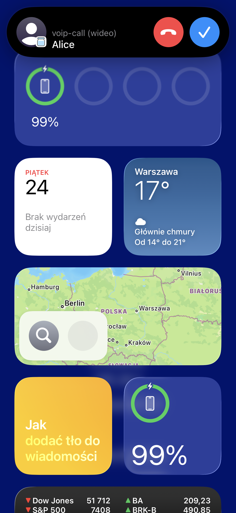
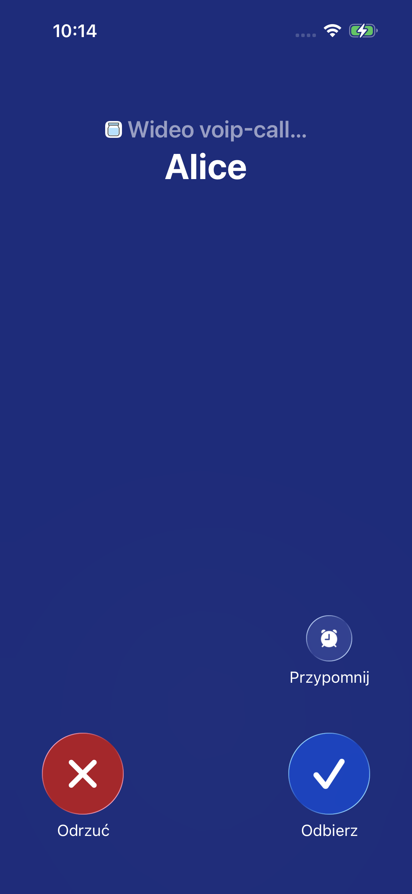
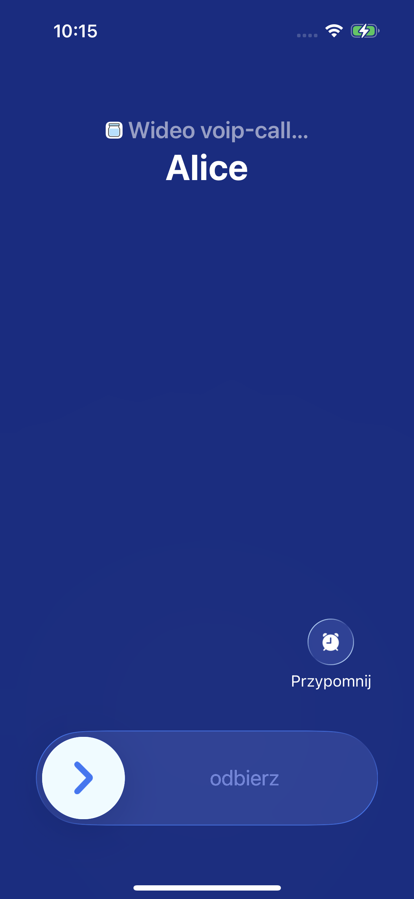
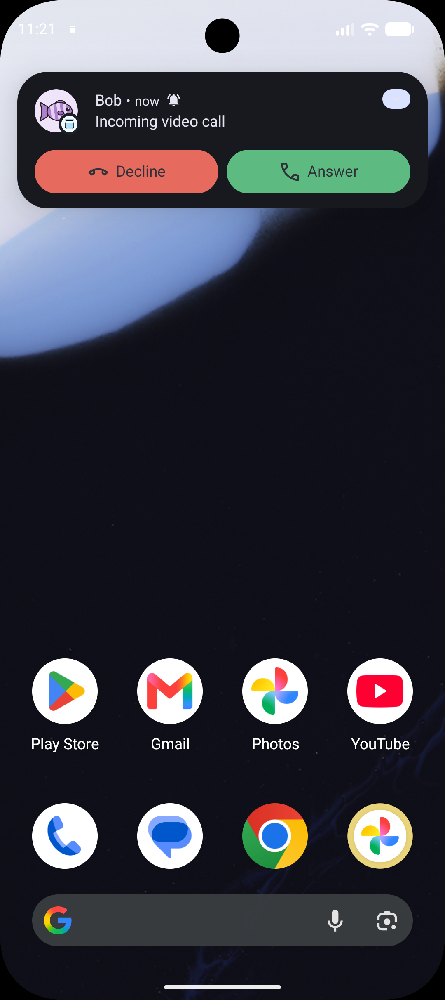
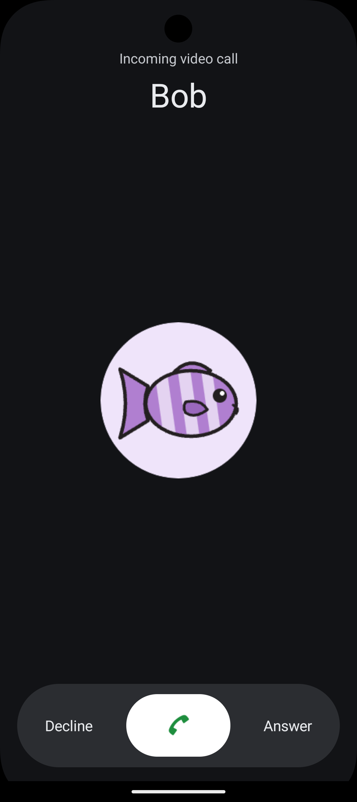
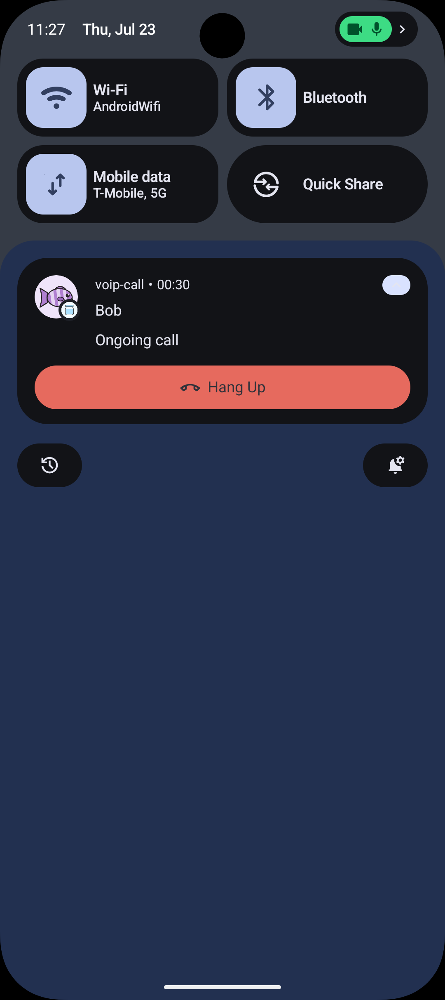
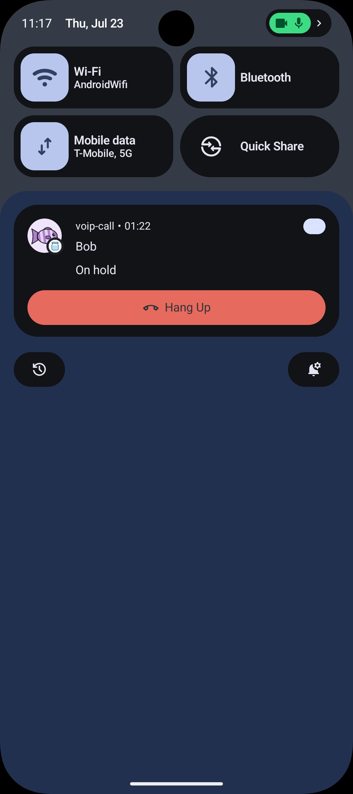
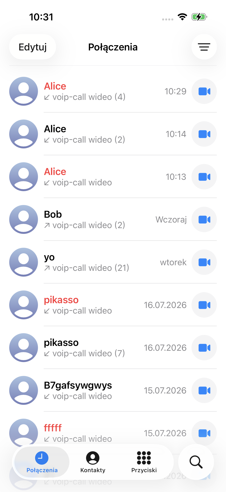

# Add Native Calling to Your React Native Apps With Fishjam

<!--
KEYWORD NOTES (delete before publishing):
- Primary keyword: "native calling" / "React Native" (both in the title). Alternatives to
  verify in Ahrefs with Patryk/Kasia: "React Native VoIP", "CallKit React Native",
  "VoIP push notifications", "React Native video call".
- Secondary keywords sprinkled through the text: CallKit, PushKit, Android Telecom,
  VoIP push notifications, FCM, incoming call UI, video call SDK.

LINKS TO VERIFY AFTER RELEASE (delete before publishing):
- Docs guide link currently points at https://docs.fishjam.io/ — replace with the exact
  URL of the "VoIP calls" how-to page once the docs are deployed
  (source: documentation/docs/how-to/client/voip-calls.mdx).
- Example link https://github.com/fishjam-cloud/web-client-sdk/tree/main/examples/mobile-client/voip-call
  is valid only after this branch is merged to main; confirm the path survived the merge.

SCREENSHOTS: all images live in ./voip-article-screenshots/ next to this file (a copy
also remains in ~/Desktop/voip-article-screenshots/). Subfolders:
- ios/ — real iPhone 16 shots; a spare not embedded below: 04-incoming-banner-in-app.png
  (banner shown over the example app). NOTE: the iOS system UI is in Polish
  ("Odrzuć/Odbierz") — consider retaking with the phone set to English for Medium.
- light/ and dark/ — Android (Pixel 9 emulator) in both system themes, identical
  filenames; swap /light/ for /dark/ in any path to switch. Shade shots staged with all
  other notifications cleared.
Markdown tables are used for the side-by-side galleries — on Medium, upload the images
and arrange them side by side manually (Medium auto-grids consecutive images).
No required shots remain. Optional nice-to-have if ever doing a two-phone call: the
example app's own in-call video screen with a real second participant.
-->

The Fishjam React Native SDK now supports native VoIP calls. A Fishjam room can ring a phone the way a real call does — through [CallKit](https://developer.apple.com/documentation/callkit) on iOS and [Telecom](https://developer.android.com/develop/connectivity/telecom) on Android — even when the app is backgrounded or was killed hours ago. The integration is a config plugin entry, a provider component, and one hook.

Until now, an incoming Fishjam call could only reach a user while your app was running, or ride a regular push notification and hope the user opened the app in time. With VoIP support, a push wakes the app and the phone **rings like a phone**: a full-screen incoming call over the lock screen, with the caller's name, ringtone, and Answer/Decline. It's the calling experience users already know from WhatsApp or Messenger — and now your app can offer the same one.

## What it looks like

On iOS, everything below is CallKit's own system UI. On Android, calls are registered with Telecom, so they show up in the system's call surfaces — the CallStyle notifications and banner — alongside a full-screen incoming-call experience that looks and behaves the way calls do on the platform.

**iOS**

|  |  |  |
| :--------------------------------------------------------------------------------------------------------------: | :--------------------------------------------------------------------------------------------------: | :------------------------------------------------------------------------------------------------------: |
|                                                Incoming (banner)                                                 |                                        Incoming (full screen)                                        |                                          Incoming (lock screen)                                          |

**Android**

|  |  |  |
| :---------------------------------------------------------------------------------------------------------------------: | :----------------------------------------------------------------------------------------------------------------------: | :---------------------------------------------------------------------------------------------------------------: |
|                                                    Incoming (banner)                                                    |                                                  Incoming (lock screen)                                                  |                                             Ongoing call notification                                             |

## One JS API over two native stacks

iOS and Android share almost nothing here. On iOS, a VoIP push travels over APNs, [PushKit](https://developer.apple.com/documentation/pushkit) wakes the app, and CallKit shows the call. On Android, a high-priority data message over [FCM](https://firebase.google.com/docs/cloud-messaging) does the waking and Telecom does the showing. The SDK drives both, so your app sees a single call flow:

1. Your backend sends the push to the callee's device.
2. The OS wakes the app — even from killed — and the SDK reports the call to CallKit or Telecom. The phone rings.
3. The user answers right there — no unlocking, no hunting for the app — and your app joins the Fishjam room like any other session.
4. Once the remote peer's media is live, your app reports the call connected. That's when the call timer starts — on the lock screen, in the Dynamic Island, in the notification shade. Real phones count from pickup, not from dialing, so the SDK does too.


_Once connected, iOS treats it like any other call: the CallKit in-call screen with the running timer, speaker, video, and mute controls._

In code, the whole integration is two pieces. First, mount `VoipProvider` — it manages the entire lifecycle of a call for you: ringing, connecting, active, hold, mute, timeouts. It doesn't need to wrap your whole app; any subtree that handles calls works, as long as it stays mounted for the duration of a call.

```tsx
<VoipProvider isVideo>{/* anything that uses useVoip */}</VoipProvider>
```

Second, react to its events with the `useVoip` hook — that's how you drive the native side. The provider tells you when a call needs a room; you join it the way you'd join any Fishjam room, and report back once media is flowing:

```tsx
const { status, currentCall, reportConnected, reportConnectFailed, endCall } =
  useVoip();

useEffect(() => {
  if (status !== "connecting") return;
  joinRoom(currentCall.roomName) // your usual Fishjam room join
    .then(reportConnected) // media is live — the native call timer starts
    .catch(reportConnectFailed);
}, [status]);

// ...and when the remote peer leaves the room: endCall('remote')
```

Everything else — peer tokens, media, your signaling — stays exactly where it already lives in your app; the provider never touches your connection.

The native configuration is generated by the SDK's Expo config plugin — enabling VoIP is a few lines in `app.json` rather than an afternoon of AppDelegate and AndroidManifest edits. Bare React Native is covered too: the docs list exactly what the plugin would have generated.

## Beyond ringing

Making the phone ring is maybe a third of what users expect from calls, because the Phone app has always done the rest. The SDK covers that rest out of the box:

- **Call waiting and hold.** A cellular call arrives mid-call and the user taps "Hold & Accept" — your app gets a hold event, pauses its mic and camera, and resumes when the cellular call ends.
- **Lock-screen mute.** Muting from the system call UI reaches your app as an event, so the native UI and your in-app button never disagree.
- **Redial from Recents.** Calls land in the iOS Phone app's call history, and tapping an entry reopens your app — even from killed — with the contact to redial.
- **Configurable timeouts.** By default, unanswered incoming calls end as missed after 45 seconds, outgoing after 60, and an answered call that can't connect media within 10 is ended instead of hanging in limbo. Each of the three is a single value in the config plugin, so you can tune ring times to your product without touching native code.
- **Coexisting with your push library.** Android delivers all FCM messages to a single service per app, so a call push would normally collide with your notification setup. The SDK takes the service slot for call pushes and natively relays everything else — messages and token refreshes — to expo-notifications, React Native Firebase, or your own service. Adding calls doesn't break the notifications you already have.



_Put the call on hold and Android's call notification flips to "On hold" — the system UI and your app always agree on the call's state._



_Every call lands in the iPhone's Recents, listed like any cellular call — and tapping an entry redials through your app._

## A complete example to start from

The release ships with a full example: a small contacts-and-calls app plus a Deno server that registers users and sends the pushes — both sides of the feature in one place you can run against your own Fishjam sandbox. You'll find it in the SDK repo under [`examples/mobile-client/voip-call`](https://github.com/fishjam-cloud/web-client-sdk/tree/main/examples/mobile-client/voip-call), with a README that walks through every native requirement on both platforms.

## Get started

[Fishjam](https://fishjam.io) is Software Mansion's hosted WebRTC platform: rooms, peers, and media streaming through small SDKs for React, React Native, and backend runtimes, with no media servers to operate yourself. VoIP calling is the newest piece of the React Native SDK — the same room your web users join in a browser can now ring a phone.

The [VoIP calls guide](https://docs.fishjam.io/) walks through the setup for Expo and bare React Native, and the [voip-call example](https://github.com/fishjam-cloud/web-client-sdk/tree/main/examples/mobile-client/voip-call) is ready to clone. And if you wire it up and something still doesn't ring, that's a gap on our end — issues are welcome.
